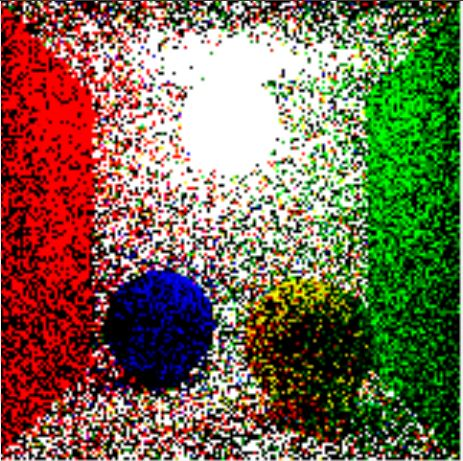
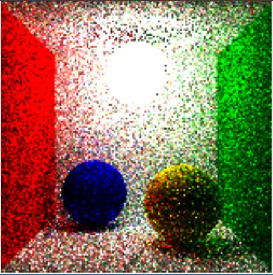
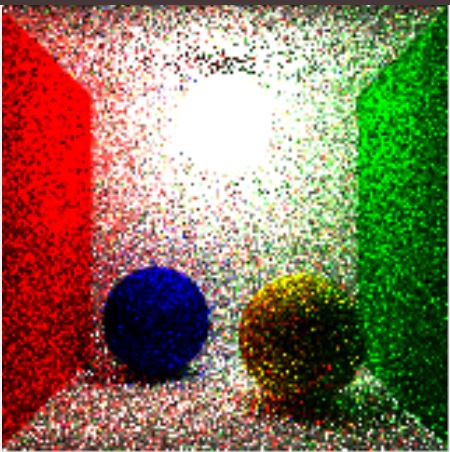
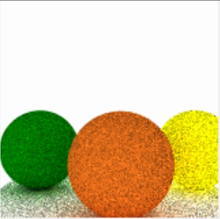
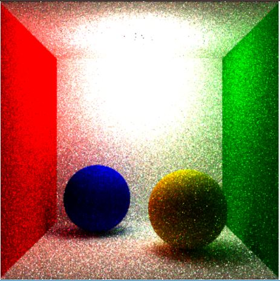

# Path tracing framework, NRG Homework 2
This repository contains the solution to the second homework of the Advanced Computer graphics masters course.

## Results: 
SPP 10, 20 bounces, no path reuse speedup, no russian roulette, Oren-Nayar materials applied (blue ball - sigma 70, yellow ball -sigma 40, walls Lambertian material)\

SPP 10, 20 bounces, **with** path reuse speedup, no russian roulette, Oren-Nayar materials applied (blue ball - sigma 70, yellow ball -sigma 40, walls Lambertian material)\

SPP 10, 20 bounces, **with** path reuse speedup, **with** russian roulette, Oren-Nayar materials applied (blue ball - sigma 70, yellow ball -sigma 40, walls Lambertian material)\

Light emission inside (acting as a spatial light), SPP 10, **with** path reuse speedup, **with** russian roulette, Lambertian materials applied\

Beauty shot, SPP 100, 20 bounces, all the speedups, all materials OrenNayar\

## Assignment:
[NRG_DN2_instructions.pdf](Instructions)
### 1. Introduction
The goal of this homework is to get familiar with path tracing and the use of different light sources and
materials in physically based rendering. Your task is to extend the path tracing framework provided with
the homework and implement a basic path tracing algorithm (section 3), spherical lights (section 4) and
the Oren-Nayar material (section 5). The homework also has some optional extensions. The homework
must be turned in before April 30, 2021. You will have to defend the homework at the laboratory
exercises. The homework is worth 10 % of the final grade. The defense of the homework after the
deadline lowers the maximum worth: 1-week extension: 7 %, 2-week extension: 5 %.
### 2 The path tracing framework
For implementation of the homework you may use the provided framework. The framework is developed
in C# and includes basic math and support for easier implementation of a path tracer. It is loosely based
on the PBRTv3 rendering framework,1 developed by authors of book Physically Based Rendering.2
Optional: You can create your own Path tracing framework to implement the homework.
### 3 Implementation of path tracing
Implement the main path tracing method in the framework (within PathTracer.cs), which uses Russian
roulette for stopping and importance sampling for choosing ray directions.
Optional: Provide appropriate support for light sampling with specular materials, such as the provided
SpecularReflection.cs.
### 4 Lights
Extend the framework with support for spherical light sources. The source of the light is a surface of a
sphere positioned within the scene. The user must be able to set the radius of the sphere and the side of
light emission (outside, inside). Implement uniform sampling of light rays from the surface. An example
of a light is already provided by the disk light (Disk.cs).

### 5 Materials
Implement the Oren-Nayar material in the framework. The template file is Lambertian.cs. 

### 6 Outputs
The expected outputs of this homework are example renderings (images), displaying the implemented
features.
