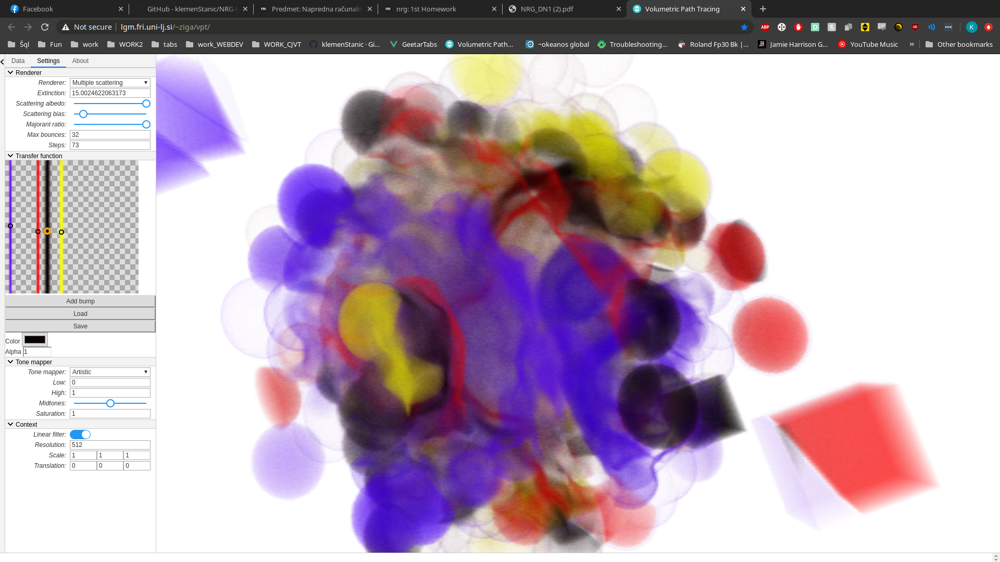
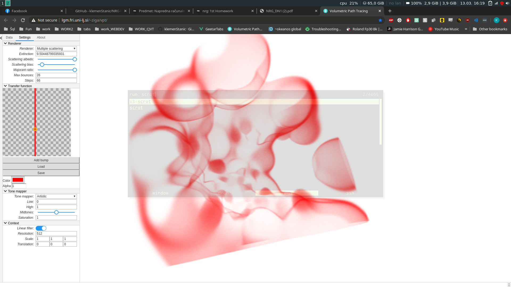

This repository contains the solution to the first homework for the Master's studies course
Advanced Computer Graphics at the Faculty of Computer and Information Science, University of Ljubljana.

## Running the interpolatation:
You can use the precompiled jar files located in the folder out/artifacts/, where interpolate.jar represents the interpolate program, the OutputProcessing.jar takes 2 parameters, first being the output file path, that was generated by the interpolate class, and the second, that represents the output file path. OutputProcessing transforms the data into uint8 encoded binary file, that can be read and visualized in the VPT software.
On the input file with 1k points, 256 res, with the "modified" method, radius parameter is 0.5:
```
/usr/lib/jvm/java-11-openjdk/bin/java -javaagent:/usr/share/idea/lib/idea_rt.jar=34289:/usr/share/idea/bin -Dfile.encoding=UTF-8 -classpath /home/klemen/FAKS/NRG/Homework1/target/classes:/home/klemen/.m2/repository/cn/jimmiez/pcutil/0.3.0/pcutil-0.3.0.jar:/home/klemen/.m2/repository/javax/vecmath/vecmath/1.5.2/vecmath-1.5.2.jar:/home/klemen/.m2/repository/com/mkobos/pca_transform/1.0.2/pca_transform-1.0.2.jar:/home/klemen/.m2/repository/gov/nist/math/jama/1.0.2/jama-1.0.2.jar com.company.interpolate < data/input1k.txt > output/output_1k_256.raw --method modified --r 0.5 --min-x -4.1 --min-y -3.45 --min-z -3.76 --max-x 4.0 --max-y 3.91 --max-z 3.73 --res-x 256 --res-y 256 --res-z 256
```

On the input file with 10k points, 256 res, with the "modified" method, radius parameter is 0.5:
```
/usr/lib/jvm/java-11-openjdk/bin/java -javaagent:/usr/share/idea/lib/idea_rt.jar=34289:/usr/share/idea/bin -Dfile.encoding=UTF-8 -classpath /home/klemen/FAKS/NRG/Homework1/target/classes:/home/klemen/.m2/repository/cn/jimmiez/pcutil/0.3.0/pcutil-0.3.0.jar:/home/klemen/.m2/repository/javax/vecmath/vecmath/1.5.2/vecmath-1.5.2.jar:/home/klemen/.m2/repository/com/mkobos/pca_transform/1.0.2/pca_transform-1.0.2.jar:/home/klemen/.m2/repository/gov/nist/math/jama/1.0.2/jama-1.0.2.jar com.company.interpolate < data/input10k.txt > output/output_10k_256.raw --method modified --r 0.5 --min-x -4.1 --min-y -3.45 --min-z -3.76 --max-x 4.0 --max-y 3.91 --max-z 3.73 --res-x 256 --res-y 256 --res-z 256
```

On the input file with 1k points, 256 res, with the "basic" method, p parameter is 1:
```
/usr/lib/jvm/java-11-openjdk/bin/java -javaagent:/usr/share/idea/lib/idea_rt.jar=34289:/usr/share/idea/bin -Dfile.encoding=UTF-8 -classpath /home/klemen/FAKS/NRG/Homework1/target/classes:/home/klemen/.m2/repository/cn/jimmiez/pcutil/0.3.0/pcutil-0.3.0.jar:/home/klemen/.m2/repository/javax/vecmath/vecmath/1.5.2/vecmath-1.5.2.jar:/home/klemen/.m2/repository/com/mkobos/pca_transform/1.0.2/pca_transform-1.0.2.jar:/home/klemen/.m2/repository/gov/nist/math/jama/1.0.2/jama-1.0.2.jar com.company.interpolate < data/input1k.txt > output/output_1k_256_basic_p_1.raw --method basic --p 1 --min-x -4.1 --min-y -3.45 --min-z -3.76 --max-x 4.0 --max-y 3.91 --max-z 3.73 --res-x 256 --res-y 256 --res-z 256
```


## Transforming the output data to uint8 format, so it can be read into VPT (http://lgm.fri.uni-lj.si/~ziga/vpt/):
1k points:
```
/usr/lib/jvm/java-11-openjdk/bin/java -javaagent:/usr/share/idea/lib/idea_rt.jar=41335:/usr/share/idea/bin -Dfile.encoding=UTF-8 -classpath /home/klemen/FAKS/NRG/Homework1/target/classes:/home/klemen/.m2/repository/cn/jimmiez/pcutil/0.3.0/pcutil-0.3.0.jar:/home/klemen/.m2/repository/javax/vecmath/vecmath/1.5.2/vecmath-1.5.2.jar:/home/klemen/.m2/repository/com/mkobos/pca_transform/1.0.2/pca_transform-1.0.2.jar:/home/klemen/.m2/repository/gov/nist/math/jama/1.0.2/jama-1.0.2.jar com.company.OutputProcessing output/output_1k_256.raw output/output_1k_256_uint8.raw
```

10k points:
```
/usr/lib/jvm/java-11-openjdk/bin/java -javaagent:/usr/share/idea/lib/idea_rt.jar=41335:/usr/share/idea/bin -Dfile.encoding=UTF-8 -classpath /home/klemen/FAKS/NRG/Homework1/target/classes:/home/klemen/.m2/repository/cn/jimmiez/pcutil/0.3.0/pcutil-0.3.0.jar:/home/klemen/.m2/repository/javax/vecmath/vecmath/1.5.2/vecmath-1.5.2.jar:/home/klemen/.m2/repository/com/mkobos/pca_transform/1.0.2/pca_transform-1.0.2.jar:/home/klemen/.m2/repository/gov/nist/math/jama/1.0.2/jama-1.0.2.jar com.company.OutputProcessing output/output_10k_256.raw output/output_10k_256_uint8.raw
```

## Results visualization in VPT:
10k points, parameters: --method modified --r 0.5 --min-x -4.1 --min-y -3.45 --min-z -3.76 --max-x 4.0 --max-y 3.91 --max-z 3.73 --res-x 256 --res-y 256 --res-z 256


1k points, parameters: --method basic --p 10 --min-x -4.1 --min-y -3.45 --min-z -3.76 --max-x 4.0 --max-y 3.91 --max-z 3.73 --res-x 256 --res-y 256 --res-z 256

